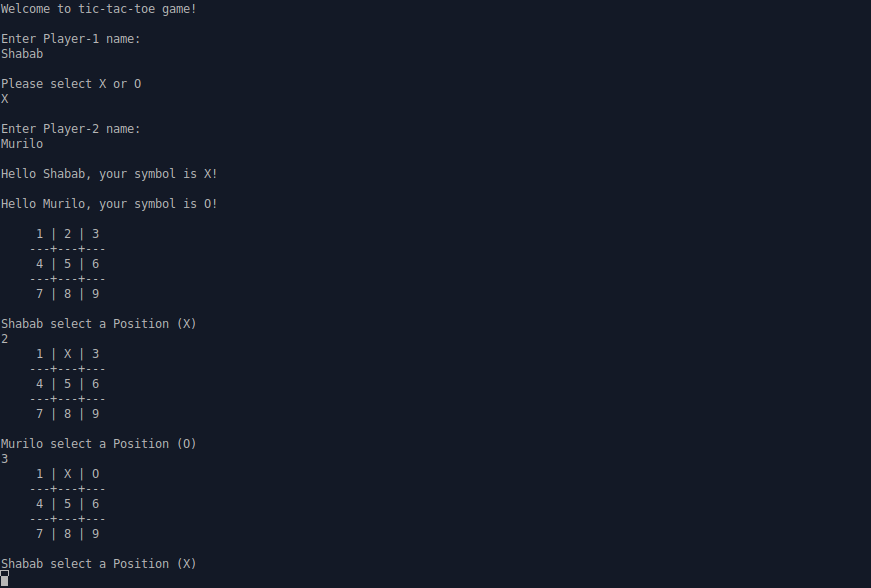
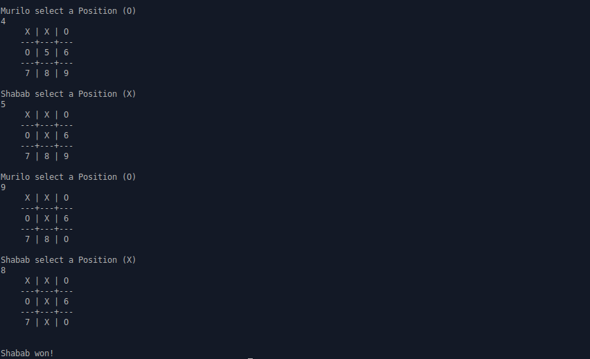

 

 

# Tic Tac Toe console game [Collaborative Project]

In this project we have built a Tic Tac Toe console game. It is developed in Ruby programming language.

>Both the players are asked to enter their names and choose symbols.

>A player can make his move by entering grid position.

## Instructions and Game rules

### Instructions
- Execute `main.rb` file from bin directory.
- Enter your names and symbols.
- Enter number from 1-9 according to game rules.

### Game Rules
- The game is played on a grid that's 3 squares by 3 squares.

- You can choose from two symbols either 'X' or 'O', your friend will automatically allocated remaining symbol. Players take turns putting their marks in empty squares.

- The first player to get 3 of her marks in a row (up, down, across, or diagonally) is the winner.

- When all 9 squares are full, the game is over. If no player has 3 marks in a row, the game ends in a draw.

## Built with

Ruby

## Live Demo

[Click to see on repl.it](https://repl.it/@shababsaifi/Tic-Tac-Toe)

## Getting Started
Clone or fork the repository.
Execute `main.rb` file

## Authors

👤 **Murilo Roque Paiva da Silva**

- Github: [@MuriloRoque](https://github.com/MuriloRoque)
- Twitter: [@MuriloRoquePai1](https://twitter.com/MuriloRoquePai1)
- LinkedIn: [MuriloRoque](https://www.linkedin.com/in/murilo-roque-b1268741/)
- Email: [muriloengqui@gmail.com](mailto:muriloengqui@gmail.com)

👤 **Shabab Ali**

- Github: [@alishabab](https://github.com/alishabab)
- Twitter: [@shabab_ali](https://twitter.com/shabab_ali)
- LinkedIn: [shababali](https://www.linkedin.com/in/shababali/)
- Email: [shababsaifi@gmail.com](mailto:shababsaifi@gmail.com)

## 🤝 Contributing

Contributions, issues and feature requests are welcome! Start by:

- Forking the project
- Cloning the project to your local machine
- `cd` into the project directory
- Run `git checkout -b your-branch-name`
- Make your contributions
- Push your branch up to your forked repository
- Open a Pull Request with a detailed description to the development branch of the original project for a review

## Show your support

Give a ⭐️ if you like this project!

